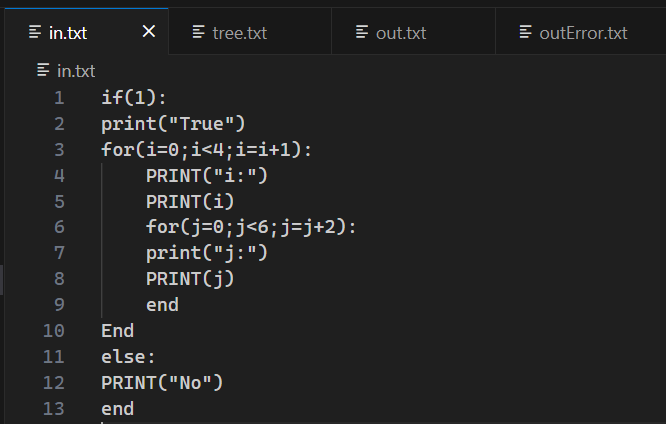
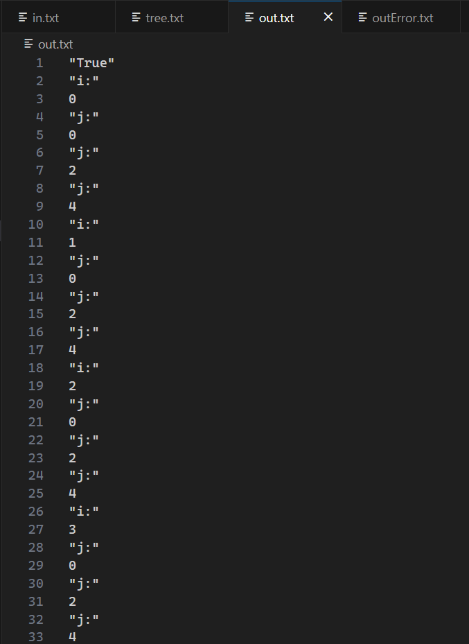

# GazaScript Compiler

GazaScript is a Basic Compiler implemented using Flex and Bison. This compiler translates custom source code written in the GazaScript language into executable instructions. The language supports basic arithmetic, logical operations, conditionals, loops, and variable assignments.

## Table of Contents
1. [Project Overview](#project-overview)
2. [Getting Started](#getting-started)
   - [Clone the Repository](#clone-the-repository)
   - [Dependencies](#dependencies)
3. [Installation](#installation)
4. [Usage](#usage)
   - [Compile the Compiler](#compile-the-compiler)
   - [Run GazaScript Programs](#run-gazascript-programs)
5. [File Structure](#file-structure)
6. [Grammar Overview](#grammar-overview)
7. [Compilation Process](#compilation-process)
8. [Execution Details](#execution-details)
9. [Sample Programs](#sample-programs)
10. [License](#license)
11. [Acknowledgments](#acknowledgments)
12. [Contact Information](#contact-information)

## Project Overview

GazaScript is designed to be a simple yet powerful language for learning the basics of compiler construction. It supports fundamental programming constructs and serves as an educational tool for understanding lexing, parsing, and abstract syntax trees.

## Getting Started

### Clone the Repository

```bash
git clone https://github.com/your-username/GazaScript.git
cd GazaScript
```

### Dependencies

Make sure you have Flex and Bison installed on your system. You can install them using your package manager:

```bash
sudo apt-get install flex bison   # For Ubuntu/Debian
```

## Installation

## Usage

### Compile the Compiler

```bash
flex 1.l
bison -d 1.y
gcc -o a.exe  .\1.tab.c .\lex.yy.c .\SyntaxTree.c
a.exe
```

### Run GazaScript Programs

```bash
./a.exe
```

## File Structure

- `1.l`: Contains the lexical analyzer (Flex) definitions.
- `1.y`: Specifies the grammar rules and actions (Bison).
- `SyntaxTree.h` and `SyntaxTree.c`: Define and implement the abstract syntax tree (AST) data structure.
- `in.txt`: Input file for GazaScript programs. Place your source code here.
- `out.txt`: Output file where the compiled program's result is stored.
- `outError.txt`: Log file capturing any errors encountered during compilation or execution.
- `tree.txt`: Text file representing the abstract syntax tree (AST) of the GazaScript program.
- `Commands.txt`: Contains commands needed to run the GazaScript compiler and execute programs.

## Grammar Overview

The GazaScript grammar includes terminals, non-terminals, rules, and semantic actions. Refer to the grammar section in the parser file (`1.y`) and Syntax-Directed-translation.pdf for a detailed breakdown.

## Compilation Process

The compilation process involves using Flex to generate the lexer (`lex.yy.c`) and Bison to generate the parser (`parser.tab.c`). The Makefile streamlines this process.

## Execution Details

The generated AST is traversed and executed to interpret GazaScript programs. The `execute_ast` function in `SyntaxTree.c` handles the interpretation logic.

## Sample Programs


<details>

  <summary>Sample one</summary>

  
  
  

</details>

<details>
  <summary>Sample two</summary>

  
  
  

</details>

<details>
    <summary>Sample tree</summary>

  
  

</details>

## License

This project is licensed under the MIT License - see the [LICENSE](LICENSE) file for details.

## Acknowledgments

- The creators of Flex and Bison for providing powerful tools for compiler construction.

- Recommended Tutorials:
  - [Bison Tutorial](https://youtu.be/OWE7jIeRETU?si=AT07_cW2iYTgGDwg)
  - [Flex Tutorial](https://www.youtube.com/watch?v=E-3IdhZh29Q)
  - [Constructing Syntax Trees Tutorial](https://www.youtube.com/watch?v=4bTvFbDc7hw)
  - [Interpreters Tutorial](https://www.youtube.com/watch?v=t0JFXnsD3UY&t=1551s)

## Contact Information

For issues, suggestions, or inquiries, please contact [sherif201665@gmail.com](mailto:sherif201665@gmail.com).
